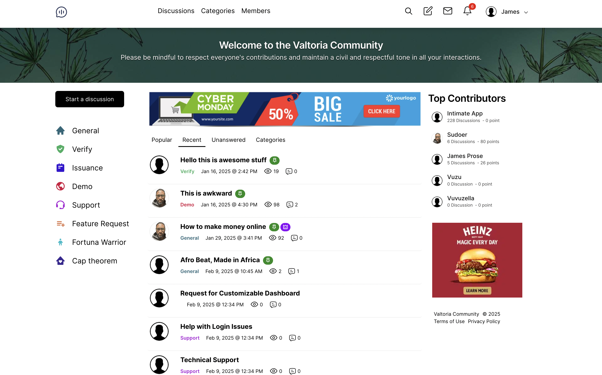
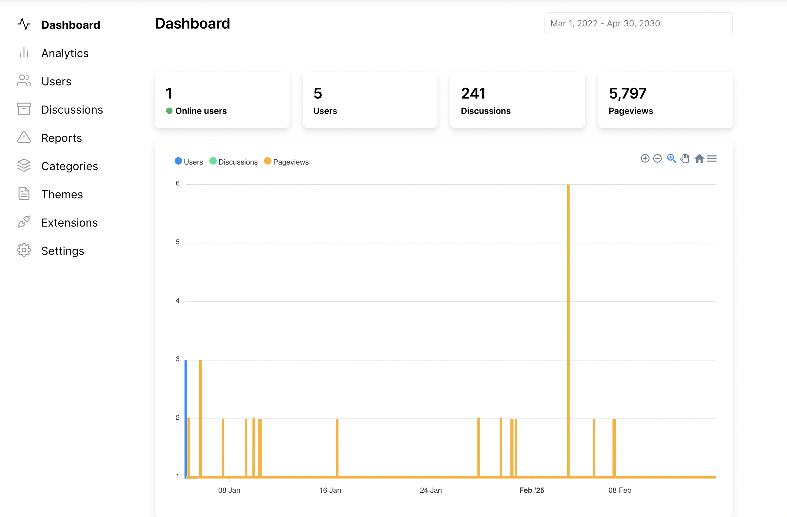
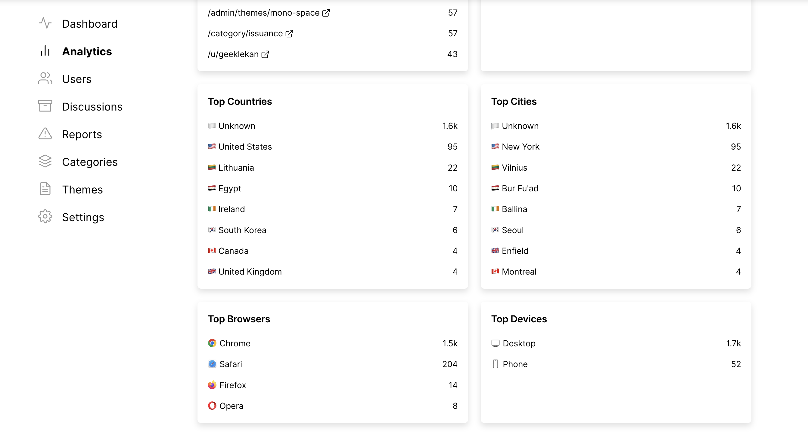
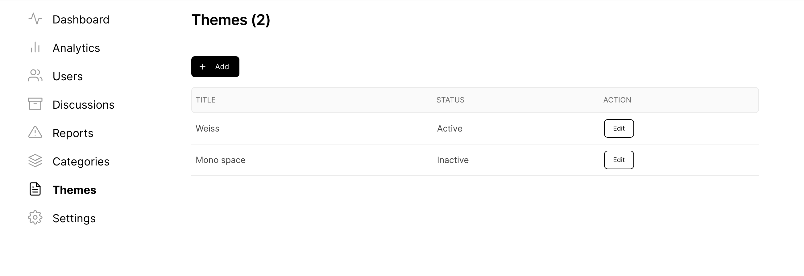
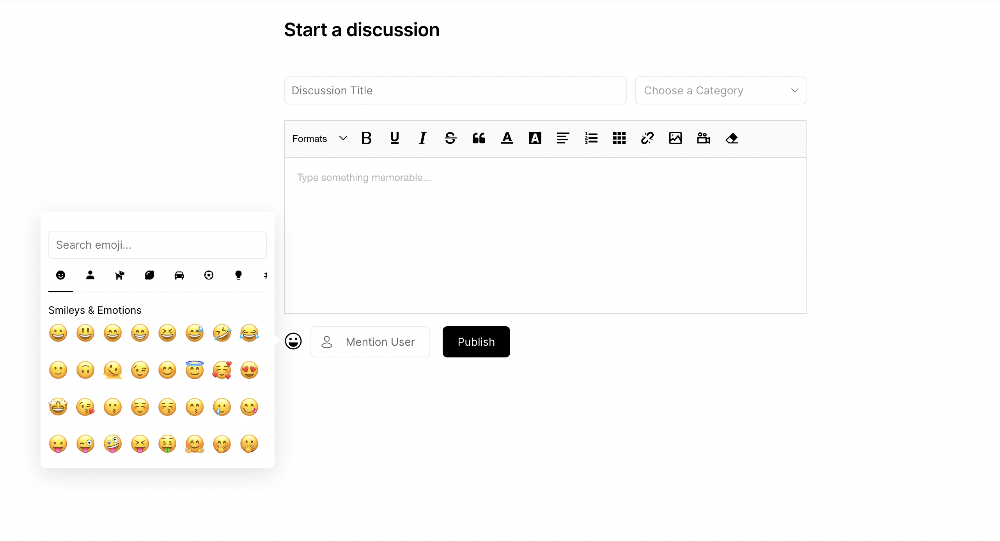

# Min Forum

Minimalistic and Modern Discussion Software

[](https://www.codacy.com/gh/minforum/minforum/dashboard?utm_source=github.com&utm_medium=referral&utm_content=minforum/minforum&utm_campaign=Badge_Grade)

[](https://github.com/prettier/prettier)

### Prerequisite

- [NodeJS 18 LTS upward](https://github.com/nvm-sh/nvm/blob/master/README.md)
- [RethinkDB 2.4 upward](https://rethinkdb.com/docs/install/)
- [Nginx latest version]()









### Installation

```
sh <(curl https://raw.githubusercontent.com/minforum/minforum/main/install/setup.sh)
```

### Development

**Install mkcert and generate certificate for localhost**
<br />
Note: Social login with facebook and google required SSL

```
npm i -g mkcert
```

```
yarn dev
```

### Production

```
yarn production
```

### Roadmap

- &#x2611; User system (member, moderator and admin)
- &#x2611; Communities or categories
- &#x2611; Discussions, comments and replies with revision note and date.
- &#x2611; Direct messaging with controls to block or accept messages from users
- &#x2611; Social account (signup and login). Facebook and Google.
- &#x2611; Social share
- &#x2611; Notifications for mentions, comments, replies, likes and messages
- &#x2611; Themes
- &#x2611; Language & Translation (English, French, Spanish, Deutsch, Chinese, Japanese, Korean, and Russian)
- &#x2611; Points system: Reward users with points for their activities and contributions
- &#x2611; Reports and flag
- &#x2611; Advert settings
- &#x2611; Badge system for recognizing user activities and achievements
- &#x2611; Site wide announcement
- &#x2611; Analytics, pageviews and post views
- &#x2611; Ban words
- &#x2610; Monetization: Offer premium features via paywalls, subscription plans, and secure payment integration
- &#x2610; Docker image
- &#x2610; Digital ocean marketplace
- &#x2610; AWS marketplace

### How to contribute

Fork the code, update and make a pull request.

### [License](LICENSE)

### Maintainers

[Olalekan Animashaun](https://github.com/kimolalekan)
